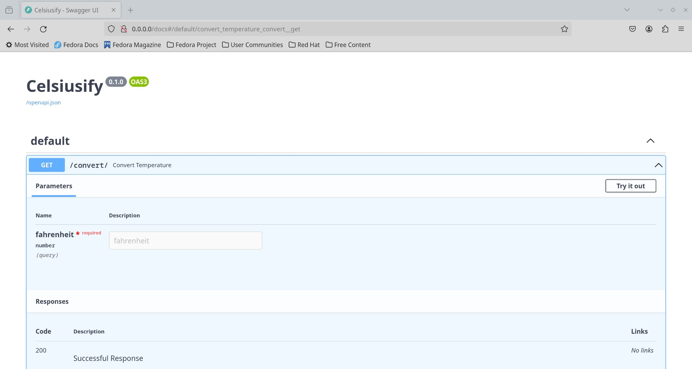
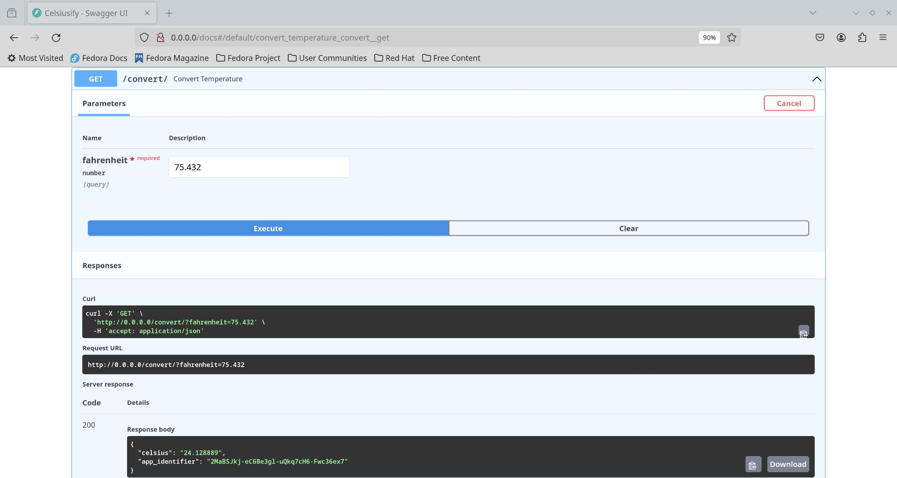
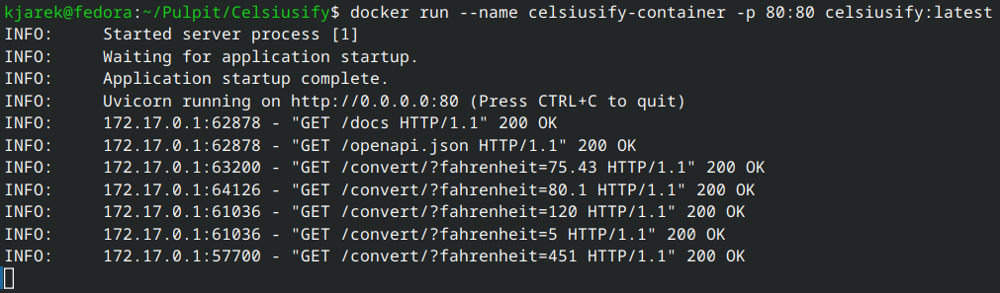
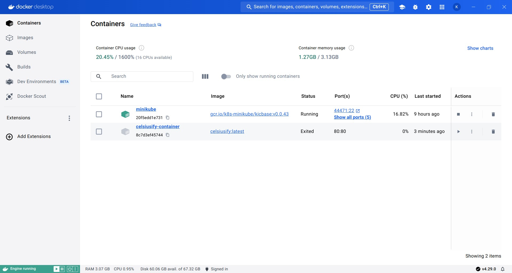

# Celsiusify

### DevOps (MLOps) benchmark project

### *(DEMO Readme)*

**DevOps** (Development and Operations) work on tasks that **bridge** the gap between software development and IT operations teams.

## Step 1. Backend web application

**Project Initialization**:

* A new directory is created for the Celsiusify project, and within it, a **Python 3.9** virtual environment (.venv) is set up.

``` bash
   # installation of pyenv (if not installed) -> recommended solution
   # following instructions from: https://github.com/pyenv/pyenv
   curl https://pyenv.run | bash

   pyenv install 3.9
   pyenv virtualenv 3.9 celsiusify
   pyenv activate celsiusify
```

* FastAPI and Uvicorn are installed using **pip** to facilitate the creation of the web app.

   It's achieved thru defining requirements.txt file:

``` plain
   fastapi>=0.68.0,<0.69.0+
   pydantic>=1.8.0,<2.0.0
   uvicorn>=0.15.0,<0.16.0
```

``` bash
   pip install -r requirements.txt
```

**API Endpoint Development**:

* A FastAPI application is developed, featuring an endpoint designed to convert temperatures from Fahrenheit to Celsius degrees:

``` python3
   app = FastAPI(title='Celsiusify')

   @app.on_event("startup")
   async def startup_event() -> None:
      string_len, constants_str = 8, string.ascii_letters + string.digits
      list_of_ids = [''.join(random.choices(constants_str, k=string_len)) for _ in range(stop=4)]
      app.app_identifier = '-'.join(list_of_ids)

   @app.get("/convert/")
   async def convert_temperature(fahrenheit: float) -> Dict[str, str]:
      celsius = (fahrenheit - 32) * 5.0/9.0
      return {"celsius": f'{celsius:.6f}', "app_identifier": app.app_identifier}
```

During the initialization phase of the Celsiusify app, a unique identifier is generated, which persists throughout the application's runtime.

**App Initialization and Runtime**:

* Application can be run thanks to Uvicorn server starting with following command:

``` bash
   uvicorn app.main:app --host 0.0.0.0 --port 80
```




## Step 2. Docker image

**Dockerfile Composition**:

* A Dockerfile is authored to encapsulate the FastAPI application within a Docker image.

   Of course, first it is necessary to install docker tools as desired: <https://docs.docker.com/engine/install/>.

* Written Dockerfile includes instructions for installing dependencies, copying necessary files, and exposing the required port *80*.

``` dockerfile
   FROM python:3.9-slim
   # environment variable
   ENV PYTHONUNBUFFERED 1

   WORKDIR /code

   COPY ./requirements.txt /code/requirements.txt

   RUN pip install --no-cache-dir --upgrade -r /code/requirements.txt

   COPY ./app /code/app

   CMD ["uvicorn", "app.main:app", "--host", "0.0.0.0", "--port", "80"]
```

**Building Docker Image**:

* Locally, the Docker image is constructed and on that way tested to ensure proper functionality and adherence to expectations.

``` bash
   docker build -t celsiusify:latest .
   docker images
   docker run --name celsiusify-container -p 80:80 celsiusify:latest
```





**Pushing to DockerHub**:

* At the end of this step, a good solution is to rely on DockerHub to push the image there using platform account.

``` bash
   docker tag celsiusify:latest <username>/celsiusify:latest
   docker push <username>/celsiusify:latest
```

Helpful resources:

<https://fastapi.tiangolo.com/deployment/docker/>

## Step 3. Helm chart for Celsiusify

**Pre-requirements:**

To complete this step, it is needed to have already installed **kubectl** and **kubernetes** (or [**minikube**](https://minikube.sigs.k8s.io/docs/start/)).

*Tip*: follow guideness from <https://linuxiac.com/how-to-install-minikube-on-linux/>.

To commands to start up **minikube** dashboard:

``` bash
   minikube start --driver=docker    
   minikube addons enable metrics-server   
   minikube addons enable dashboard  
   minikube dashboard   
```

**Chart Structure Setup**:

* A directory structure is established for the Helm chart, incorporating essential templates and values files. Below is shown celsiusify-chart directory structure:

``` directory
   /my_project
   |-- /app
   |   |-- main.py
   |-- /celsiusify-chart
   |   |-- Chart.yaml
   |   |-- values.yaml
   |   |-- /templates
   |       |-- deployment.yaml
   |       |-- service.yaml
   |-- requirements.txt
   |-- Dockerfile
   |-- README.md
```

Configuration for kubernetes environment is put in  `celsiusify-chart/values.yaml`:

``` kubernetes
   replicaCount: 1
   app:
   name: celsiusify
   namespace: default
   image:
   name: celsiusify
   tag: latest
   owner: <dockerhub-username>
   pullPolicy: IfNotPresent
   container:
   name: celsiusify-container
   service:
   type: ClusterIP
   port: 8080
   targetPort: 80
   autoscaling:
   enabled: true
   minReplicas: 1
   maxReplicas: 5
   targetCPUUtilizationPercentage: 50
```

The `celsiusify-chart/values.yaml` file configures the deployment of the Celsiusify application in a Kubernetes environment using Helm. It ensures the Celsiusify application is deployed with appropriate scaling and service exposure settings in a Kubernetes environment.

**Configuration of Deployment and Service**:

* Configuration files for deployment (`deployment.yaml`) and service (`service.yaml`) are tailored to meet the app's requirements.
* Auto-scaling based on CPU usage metrics is implemented to dynamically adjust app replicas.

## Step 4. Locust for performance testing

**Locust Dockerization**:

* A Dockerfile is crafted to define the Locust testing environment and scenarios.

**Helm Chart for Locust Deployment**:

* A Helm chart is created to streamline the deployment of Locust on Kubernetes, facilitating efficient testing.

**Execution of Performance Tests**:

* The Locust Helm chart is deployed, initiating performance tests against the FastAPI application.

## Step 5. CI pipeline implementation

**Pipeline Configuration**:

* A CI pipeline is established utilizing tools like **GitHub Actions** or Jenkins.
* Stages within the pipeline are configured to encompass linting, testing, Docker image building, Docker Hub pushing, and Helm chart syntax validation.

## Step 6. TensorFlow model with TensorFlow Serving

**TensorFlow Serving Docker Image Creation**:

* A Dockerfile is authored to bundle TensorFlow Serving alongside the TensorFlow model files.

**Helm Chart Adjustment**:

* The Helm chart is updated to facilitate the deployment of the TensorFlow Serving image.

**Performance Testing Incorporation**:

* The performance tests conducted with Locust are replicated with the TensorFlow Serving deployment to gauge its efficiency.

## Step 7. Statistics files and report

**Evaluation of Performance Metrics**:

* Performance metrics obtained from testing are meticulously analyzed to discern trends and patterns.

**`results` Folder Establishment**:

* Within the repository, a designated `results` folder is established to house statistical files in CSV format.
* A concise report, comparing the performance of the FastAPI solution against TensorFlow Serving, is meticulously crafted.
* This report is transformed into a PDF format and uploaded to the `results` folder within the repository for easy access and reference.
