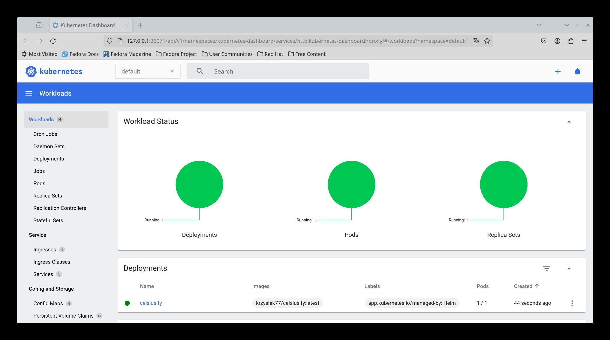
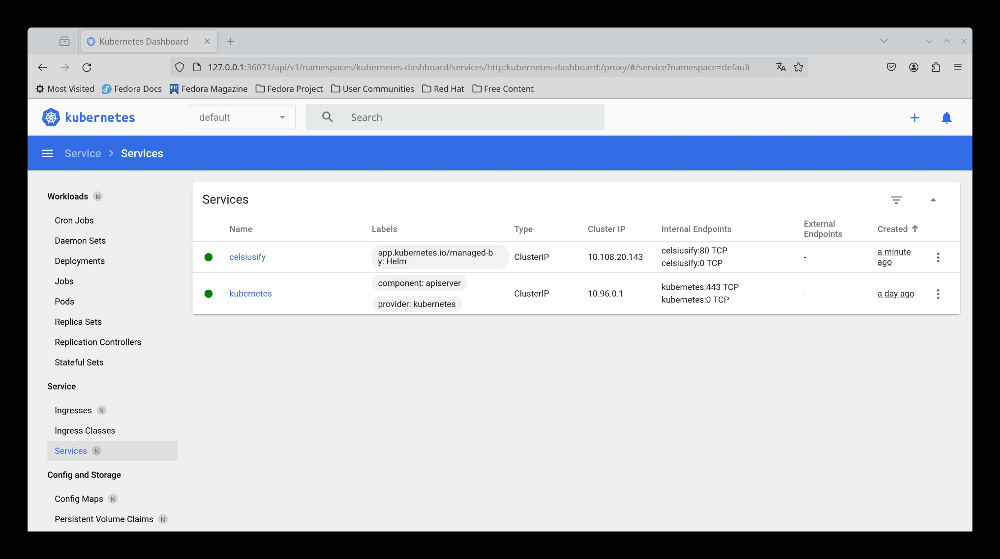
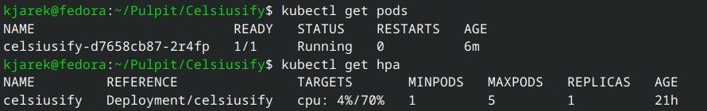
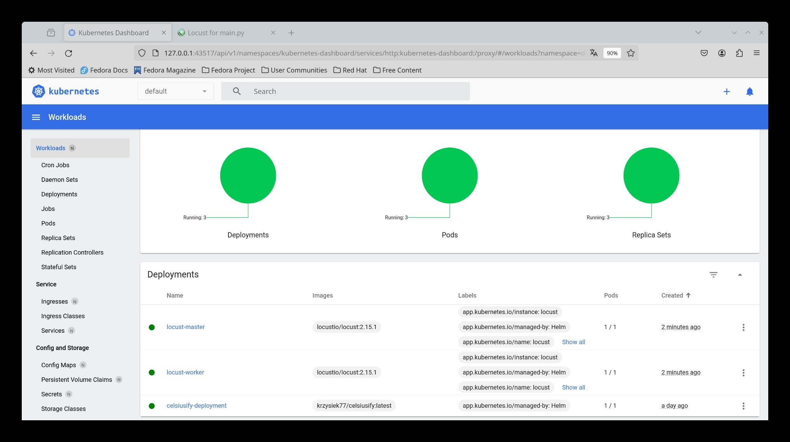
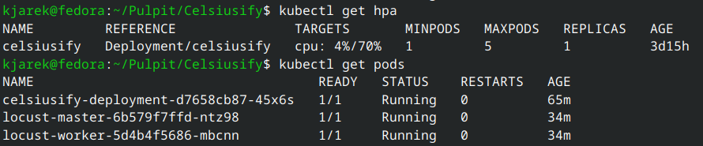
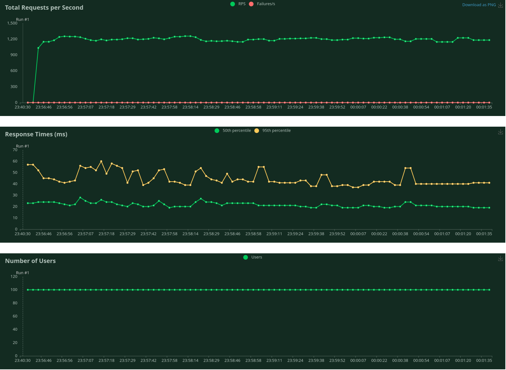

# Celsiusify

### DevOps (MLOps) benchmark project

**DevOps** (Development and Operations) work on tasks that **bridge** the gap between software development and IT operations teams.

## Step 1. Backend web application

**Project Initialization**:

* A new directory is created for the Celsiusify project, and within it, a **Python 3.9** virtual environment (.venv) is set up (of course, it's possible to use newer Python, but in case if FastAPI would cooperate with it).

``` bash
   # installation of pyenv (if not installed) -> recommended solution
   # after following instructions from: https://github.com/pyenv/pyenv
   curl https://pyenv.run | bash

   pyenv install 3.9
   pyenv virtualenv 3.9 celsiusify
   pyenv activate celsiusify
```

* FastAPI and Uvicorn are installed using **pip** to facilitate the creation of the web app.

   It's achieved thru defining requirements.txt file:

``` bash
   fastapi>=0.68.0,<0.69.0+
   pydantic>=1.8.0,<2.0.0
   uvicorn>=0.15.0,<0.16.0
```

``` bash
   pip install -r requirements.txt
```

**API Endpoint Development**:

* A FastAPI application is developed, featuring an endpoint designed to convert temperatures from Fahrenheit to Celsius degrees:

``` python
   app = FastAPI(title='Celsiusify')

   @app.on_event("startup")
   async def startup_event() -> None:
      string_len, constants_str = 8, string.ascii_letters + string.digits
      list_of_ids = [''.join(random.choices(constants_str, k=string_len)) for _ in range(stop=4)]
      app.app_identifier = '-'.join(list_of_ids)

   @app.get("/convert/")
   async def convert_temperature(fahrenheit: float) -> Dict[str, str]:
      celsius = (fahrenheit - 32) * 5.0/9.0
      return {"celsius": f'{celsius:.6f}', "app_identifier": app.app_identifier}
```

   During the initialization phase of the Celsiusify app, a unique identifier is generated, which persists throughout the application's runtime.

**App Initialization and Runtime**:

* Application can be run thanks to Uvicorn server starting with following command:

``` bash
   uvicorn app.main:app --host 0.0.0.0 --port 80
```


## Step 2. Docker image

**Dockerfile Composition**:

* A Dockerfile is authored to encapsulate the FastAPI application within a Docker image.

   Of course, first it is necessary to install docker tools as desired: <https://docs.docker.com/engine/install/>.

* Written Dockerfile includes instructions for installing dependencies, copying necessary files, and exposing the required port *80*.

``` dockerfile
   FROM python:3.9-slim
   # environment variable
   ENV PYTHONUNBUFFERED 1

   WORKDIR /code

   COPY ./requirements.txt /code/requirements.txt

   RUN pip install --no-cache-dir --upgrade -r /code/requirements.txt

   COPY ./app /code/app

   CMD ["uvicorn", "app.main:app", "--host", "0.0.0.0", "--port", "80"]
```

**Building Docker Image**:

* Locally, the Docker image is constructed and on that way tested to ensure proper functionality and adherence to expectations.

``` bash
   docker build -t celsiusify:latest .
   docker images
   docker run --name celsiusify-container -p 80:80 celsiusify:latest
```


**Pushing to DockerHub**:

* At the end of this step, a good solution is to rely on DockerHub to push the image there using platform account.

``` bash
   docker tag celsiusify:latest <username>/celsiusify:latest
   docker push <username>/celsiusify:latest
```

Helpful resources:

<https://fastapi.tiangolo.com/deployment/docker/>

## Step 3. Helm chart for Celsiusify

**Pre-requirements:**

To complete this step, it is needed to have already installed **kubectl** and **kubernetes** (or [**minikube**](https://minikube.sigs.k8s.io/docs/start/)).

*Tip*: follow guideness from <https://linuxiac.com/how-to-install-minikube-on-linux/>.

To commands to start up **minikube** dashboard:

``` bash
   minikube start --driver=docker    
   minikube addons enable metrics-server   
   minikube addons enable dashboard  
   minikube dashboard   
```

**Chart Structure Setup**:

* A directory structure is established for the Helm chart, incorporating essential templates and values files. Below is shown celsiusify-chart directory structure:

``` directory
   /my_project
   |-- /app
   |   |-- main.py
   |-- /celsiusify-chart
   |   |-- Chart.yaml
   |   |-- values.yaml
   |   |-- /templates
   |       |-- deployment.yaml
   |       |-- service.yaml
   |-- requirements.txt
   |-- Dockerfile
   |-- README.md
```

Configuration for kubernetes environment is put in  `celsiusify-chart/values.yaml`:

``` kubernetes
   replicaCount: 1
   app:
   name: celsiusify
   namespace: default
   image:
   name: celsiusify
   tag: latest
   owner: <dockerhub-username>
   pullPolicy: IfNotPresent
   container:
   name: celsiusify-container
   service:
   type: ClusterIP
   port: 8080
   targetPort: 80
   autoscaling:
   enabled: true
   minReplicas: 1
   maxReplicas: 5
   targetCPUUtilizationPercentage: 50
```

The `celsiusify-chart/values.yaml` file configures the deployment of the Celsiusify application in a Kubernetes environment using Helm. It ensures the Celsiusify application is deployed with appropriate scaling and service exposure settings in a Kubernetes environment.

**Configuration of Deployment and Service**:

* Configuration files for deployment (`deployment.yaml`) and service (`service.yaml`) are tailored to meet the app's requirements.

   [celsiusify-chart/templates/deployment.yaml](https://github.com/KrzysiekJa/Celsiusify/blob/main/celsiusify-chart/templates/deployment.yaml)  
   [celsiusify-chart/templates/service.yaml](https://github.com/KrzysiekJa/Celsiusify/blob/main/celsiusify-chart/templates/service.yaml)

* Auto-scaling based on CPU usage metrics is implemented to dynamically adjust app replicas.

   Also, in Dockerfile special uvicorn flag `"--proxy-headers"` is added in its call command.

``` bash
   helm package celsiusify-chart
   helm upgrade -i celsiusify ./celsiusify-release-0.1.0.tgz
```







When the CPU usage of the pods exceeds the target CPU utilization percentage specified in the Horizontal Pod Autoscaler (HPA) configuration, then the HPA triggers and requests more pods to be created. The HPA communicates with the Kubernetes control plane, which then instructs the Deployment controller to create additional pods.

Helpful resources:

<https://tamerlan.dev/load-balancing-in-kubernetes-a-step-by-step-guide/>  
<https://kubernetes.io/docs/tasks/run-application/horizontal-pod-autoscale-walkthrough/>  
<https://kubernetes.io/docs/tasks/debug/debug-application/debug-service/>  

## Step 4. Locust for performance testing

**Locustfile**:

* A `locustfile` is crafted to define the Locust testing environment and scenarios. Below is shown code of mentioned file:

``` python
   class WebsiteUser(HttpUser):
      wait_time = between(min_wait=0.005, max_wait=0.1) # in secs
      host = "http://<cluster_ip>:8080" # service endpoint
    
   @task
   def my_task(self):
      random_num: float = random.randint(a=0, b=1000) + random.uniform(a=0, b=1)
      response = self.client.get(f'/convert/?fahrenheit={random_num}')
      pass
```

   `cluster_ip` address should be available through command:

``` bash
   kubectl get svc
```

**Helm Chart for Locust Deployment**:

* A Helm chart is created to streamline the deployment of Locust on Kubernetes, facilitating efficient testing.

   Commands listed below perform installation of the Locust Helm chart from the `deliveryhero/locust` repository, with specific configuration settings for the load testing.

``` bash
   kubectl create configmap celsiusify-loadtest-locustfile --from-file locust/main.py  
   kubectl create configmap celsiusify-loadtest-lib --from-file locust/lib/   
   helm install locust deliveryhero/locust \ 
      --set loadtest.name=celsiusify-loadtest \ 
      --set loadtest.locust_locustfile_configmap=celsiusify-loadtest-locustfile \   
      --set loadtest.locust_lib_configmap=celsiusify-loadtest-lib 
   kubectl --namespace default port-forward service/locust 8089:8089
```

By using a Helm chart, the deployment of Locust on Kubernetes is streamlined, making it easier to manage the lifecycle of the load testing application. Helm charts provide a standardized way to package, configure, and deploy Kubernetes applications, simplifying the process of setting up and running Locust for load testing purposes.





**Execution of Performance Test**:

* The Locust chart is deployed, initiating performance test against the Celsiusify.

   Test is been conducted for 5 minutes for 100 users, with spawn rate of 100. Below, test statistics are gathered on plots:



Helpful resources:

<https://artifacthub.io/packages/helm/deliveryhero/locust>  
<https://docs.locust.io/en/stable/running-in-docker.html#>  
<https://www.youtube.com/watch?v=S2fjd1Q8HiQ>

## Step 5. CI pipeline implementation

**Pipeline Configuration**:

* A CI pipeline is established utilizing **GitHub Actions** tool.

   Stages within the pipeline are configured to encompass linting, testing, Docker image building, Docker Hub pushing, and Helm chart syntax validation:

``` yaml
   name: CI

   on:
   push:
      branches:
         - main

   jobs:
   lint:
      name: Linting
      runs-on: ubuntu-latest
      steps:
         - name: Checkout code
         uses: actions/checkout@v2

         - name: Install Python
         uses: actions/setup-python@v2
         with:
            python-version: 3.9
         
         - name: Install dependencies
         run: pip install -r requirements.txt

         - name: Install dependencies
         run: pip install pylint

         - name: Run pylint
         run: pylint app/main.py

   test:
      name: Testing
      runs-on: ubuntu-latest
      steps:
         - name: Checkout code
         uses: actions/checkout@v2

         - name: Install Docker
         uses: docker/setup-buildx-action@v1

         - name: Build Docker Image
         run: docker build -t celsiusify:latest .

   push:
      name: Push Docker Image
      runs-on: ubuntu-latest
      steps:
         - name: Checkout code
         uses: actions/checkout@v2
         
         - name: Build Docker Image
         run: docker build -t "${{ secrets.DOCKERHUB_USERNAME }}/celsiusify:latest" .

         - name: Log in to Docker Hub
         run: echo "${{ secrets.DOCKERHUB_TOKEN }}" | docker login -u "${{ secrets.DOCKERHUB_USERNAME }}" --password-stdin

         - name: Push Docker Image
         run: docker push "${{ secrets.DOCKERHUB_USERNAME }}"/celsiusify:latest

   helm:
      name: Helm Chart Syntax Check
      runs-on: ubuntu-latest
      steps:
         - name: Checkout code
         uses: actions/checkout@v2

         - name: Install Helm
         run: |
            curl -fsSL -o get_helm.sh https://raw.githubusercontent.com/helm/helm/master/scripts/get-helm-3
            chmod +x get_helm.sh
            ./get_helm.sh

         - name: Helm Chart Lint
         run: helm lint ./celsiusify-chart
```

* To proceed with setting up secrets for Docker Hub authentication in GitHub Actions, consecutive steps need to be followed:

   **Create Docker Hub Access Token**:  
      Log in to your Docker Hub account.  
      Navigate to *Account Settings > Security > New Access Token*.  
      Give your token a description and select the necessary permissions (e.g. write access for pushing images).  
      Click *Create* and copy the generated token. Note: Once you navigate away from this page, you won't be able to access the token again.

   **Add Docker Hub Username Secret**:  
      In your GitHub repository, go to *Settings > Secrets and variables > Actions > New repository secret*.  
      Enter `DOCKERHUB_USERNAME` as the name and your Docker Hub username as the value.  
      Click *Add secret*.

   **Add Docker Hub Token Secret**:  
      In your GitHub repository, go to *Settings > Secrets and variables > Actions > New repository secret*.  
      Enter `DOCKERHUB_TOKEN` as the name and paste the Docker Hub access token as the value.  
      Click *Add secret*.

   **Modify GitHub Actions Workflow**:  
      In your GitHub Actions workflow (`ci.yml`), update the Docker login step to use the secrets:

``` yaml
         - name: Build Docker Image
         run: docker build -t "${{ secrets.DOCKERHUB_USERNAME }}/celsiusify:latest" .

         - name: Log in to Docker Hub
         run: echo "${{ secrets.DOCKERHUB_TOKEN }}" | docker login -u "${{ secrets.DOCKERHUB_USERNAME }}" --password-stdin

         - name: Push Docker Image
         run: docker push "${{ secrets.DOCKERHUB_USERNAME }}"/celsiusify:latest
```

## Step 6. TensorFlow model with TensorFlow Serving

**TensorFlow Serving Docker Image Creation**:

* A Dockerfile is authored to bundle TensorFlow Serving alongside the TensorFlow model files.

**Helm Chart Adjustment**:

* The Helm chart is updated to facilitate the deployment of the TensorFlow Serving image.

**Performance Testing Incorporation**:

* The performance tests conducted with Locust are replicated with the TensorFlow Serving deployment to gauge its efficiency.

## Step 7. Statistics files and report

**Evaluation of Performance Metrics**:

* Performance metrics obtained from testing are meticulously analyzed to discern trends and patterns.

**`results` Folder Establishment**:

* Within the repository, a designated `results` folder is established to house statistical files in CSV format.
* A concise report, comparing the performance of the FastAPI solution against TensorFlow Serving, is meticulously crafted.
* This report is transformed into a PDF format and uploaded to the `results` folder within the repository for easy access and reference.
